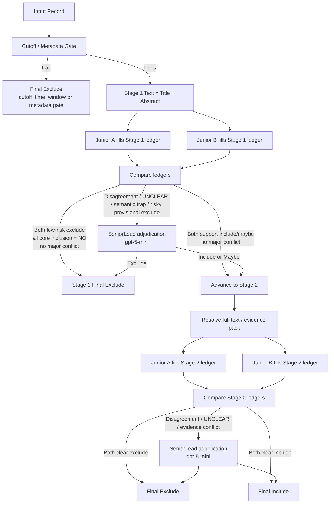

# `#2 criterion ledger` 與 `SeniorLead` 多路徑流程圖

日期：2026-04-15  
語言：繁體中文  
定位：把 `criterion ledger`、`SeniorLead`、以及多 reviewer 流程講清楚

---

## 1. 先用白話講：`ledger` 到底是什麼

`criterion ledger` 不是單純「把 criteria 拆開來一條條判」而已。

它真正的意思是：

- 把每一條 criterion 都變成一筆**可追溯的審核紀錄**
- 每位 reviewer 都不是直接回答「收不收」
- 而是先留下：
  - 這條 criterion 到底是 `YES / NO / UNCLEAR`
  - 支持它的證據是什麼
  - 反證是什麼
  - 現在是看不到，還是真的不成立

白話一點：

- 不是先問「這篇像不像」
- 而是先問「哪幾條 criteria 有證據、哪幾條沒有、哪幾條互相打架」

`ledger` 的精華不是 JSON 這件事本身。  
它的精華是：

1. reviewer 先留下可核對的中間物件
2. senior 看的不是散亂 impression，而是兩位 reviewer 的 criterion-level 記錄
3. 最後決策是根據 ledger 做 adjudication，不是直接靠感覺翻案

---

## 2. 為什麼你以前做過 criteria decomposition，結果卻沒有進步

這件事很正常，不代表 `ledger` 沒價值。

最常見的原因有五個：

1. **只有拆，但沒有共享物件**
   - reviewer 雖然一條條判了
   - 但最後沒有留下能讓下一關直接使用的共用 ledger

2. **只有一個 reviewer**
   - 同一個模型自己拆、自己判、自己總結
   - 盲點還是同一個盲點

3. **最後還是太快壓成單一分數**
   - `stage_score` 一出來，前面的 criterion-level 訊息就被浪費掉

4. **沒有 routing**
   - 難 case 沒有進 senior lane
   - 所以 decomposition 只是讓同一個 reviewer 多做幾步，未必更準

5. **senior 沒有真的用 ledger 做判斷**
   - 如果 senior 只是再讀一次全文或摘要
   - 而不是看「哪幾條 criteria 在兩位 reviewer 之間衝突」
   - 那就失去 `ledger` 的核心價值

所以真正要做的不是：

- 「讓 reviewer 多回答幾題」

而是：

- 「讓不同 reviewer 都用同一個 criterion-level record schema 留下可比對證據，再讓 senior 用它 adjudicate」

---

## 3. 這裡到底需不需要至少兩個 reviewer

如果你要的是**完整版 `#2 ledger + senior adjudication`**，答案是：

- **對，至少兩個 reviewer 比較合理**

原因很直接：

- `ledger` 的價值之一就是讓 senior 比對**不同 reviewer 在同一條 criterion 上到底哪裡不一致**
- 如果只有一個 reviewer，senior 最多只能看「同一個 reviewer 的前後兩次輸出」
- 那比較像 second pass，不是真正的 adjudication

### 最低可行版本

- `Reviewer A`
- `SeniorLead`

這是最省錢的兩 reviewer 版本。

### 比較對齊 repo current kernel 的版本

- `Junior Reviewer A`
- `Junior Reviewer B`
- `SeniorLead`

這是我比較建議的版本。  
如果你說強一點的 reviewer 用 `gpt-5-mini`，那最合理的配置是：

- `Junior A`: 較便宜模型
- `Junior B`: 較便宜模型
- `SeniorLead`: `gpt-5-mini`

---

## 4. 這個設計裡，`SeniorLead` 到底是什麼

在這個流程裡，`SeniorLead` 不是新的 criteria。

它的任務只有三件事：

1. 看兩位 reviewer 的 `criterion ledger`
2. 找出：
   - 哪條 criterion 真正有證據
   - 哪條只是 topic similarity
   - 哪條目前只能 `UNCLEAR`
3. 對 routed case 做 final adjudication

所以 `SeniorLead` 不是：

- 自由辯論 agent
- 隨便改 criteria 的人
- 多一個 impression scorer

`SeniorLead` 的正確角色是：

- criterion-level adjudicator
- risk-case resolver
- final override lane

---

## 5. 我建議的完整版流程

下面這張圖是我建議的完整版流程。  
它是：

- `#2 criterion ledger` 當主體
- `#1 verification routing` 當分流邏輯
- `SeniorLead(gpt-5-mini)` 當高可靠 lane

---

## 6. 每個 reviewer 到底要交什麼

每位 reviewer 不應該直接只交一個 `include/exclude`。

每位 reviewer 至少要交：

1. `criterion_assessments[]`
   - `criterion_id`
   - `status = YES / NO / UNCLEAR`
   - `supporting_quotes`
   - `counter_quotes`
   - `missingness_reason`
   - `notes`

2. `stage_score`
   - `1-2 -> exclude`
   - `3 -> maybe`
   - `4-5 -> include`

3. `manual_review_needed`
   - reviewer 自己是否覺得這篇應該 route

4. `routing_note`
   - 這篇為什麼危險

白話講：

- reviewer 不只是給答案
- reviewer 還要交「答案是怎麼來的」

---

## 7. 真正的 `ledger` 精華在哪裡

真正的 `ledger` 精華不是 reviewer 多回答幾題，而是：

### 精華 1：senior 不再看散亂理由

senior 應該看的是：

- A 在 `I1` 判 `YES`
- B 在 `I1` 判 `UNCLEAR`
- A 與 B 用的是哪段 evidence
- 衝突點到底在哪裡

而不是：

- 兩段長長的 reviewer 小作文

### 精華 2：可以明確區分兩種錯誤

`ledger` 讓你知道：

- 是 criteria 本身寫得不清楚
- 還是 reviewer 找錯證據
- 還是 senior 在錯的 criterion 上翻案

### 精華 3：routing 會更有根據

route 不該只靠「模型說我不確定」。

更好的 route trigger 應該是：

- 核心 inclusion criterion 仍 `UNCLEAR`
- A / B 在同一條 criterion 上相反
- stage1 想排除，但核心 inclusion 沒有全部被明確否定
- 命中已知 semantic trap

---

## 8. Stage 1 與 Stage 2 的差別

這裡也很重要。

### Stage 1

- 只能用 title/abstract
- 允許更多 `UNCLEAR`
- 重點是不要過早排除

### Stage 2

- 可以用 full text 或 targeted evidence pack
- 應該把更多 `UNCLEAR` 解掉
- 重點是 final include / exclude

白話講：

- Stage 1 比較像高召回前哨站
- Stage 2 才是完整證據判斷

---

## 9. 什麼情況下不應該進 senior

不是所有 case 都該送 `SeniorLead`。

如果以下條件都成立，其實可以直接結案：

- 兩位 juniors 都判低分排除
- 核心 inclusion criteria 全部明確 `NO`
- 沒有 `UNCLEAR`
- 沒有 evidence conflict
- 沒踩到 paper-specific semantic trap

白話講：

- 很明顯的低風險排除，不要浪費 `gpt-5-mini`

---

## 10. 什麼情況下一定要進 senior

這幾種最應該送：

1. A / B 在核心 criterion 上明顯不一致
2. 有核心 `UNCLEAR`
3. Stage 1 想排除，但其實只是證據不足
4. 命中 paper-specific semantic trap
5. Full text 出現 supporting / counter evidence 衝突

---

## 11. 最低成本版本與比較穩的版本

### 最低成本版本

- `Junior A`
- `SeniorLead = gpt-5-mini`

優點：

- 便宜
- 比 single reviewer + rerun 更像真正 adjudication

缺點：

- 沒有兩位 juniors 的 criterion-level disagreement 可以看

### 比較穩的版本

- `Junior A`
- `Junior B`
- `SeniorLead = gpt-5-mini`

優點：

- 最符合 ledger 的精神
- senior 有真正的衝突可比

缺點：

- 比兩 reviewer 版本貴

---

## 12. 這份流程和你之前做過的事，最大的差別是什麼

最大的差別不是「有沒有 decomposition」。

最大的差別是：

1. decomposition 變成共享 ledger，而不是 reviewer 自己用完就丟
2. 有兩位 reviewers，而不是同一位 reviewer 自問自答
3. 有 senior lane，而不是 same-model second pass
4. route policy 是 criterion-level 的，不是籠統 rerun

白話一句話：

- 你以前比較像「把問題拆開再自己回答」
- 這個版本是「兩位 reviewer 先交同一張檢查表，再由 senior 看檢查表哪裡衝突，最後裁決」

---

## 13. 目前建議

如果你現在真的要往這條線做，我的建議是：

1. 先只做 `2409 + 2511`
2. 先做 `2 juniors + 1 senior(gpt-5-mini)` 的 Stage 1 / Stage 2 ledger 流程
3. 先不要把 retrieval 和 calibration 一次全混進去
4. 先驗證：
   - ledger 能不能讓 senior 判得更穩
   - routing 能不能避免全量 reroute

這樣比較容易知道：

- 到底是 `ledger` 有效
- 還是只是多花錢讓模型再看一次而已
