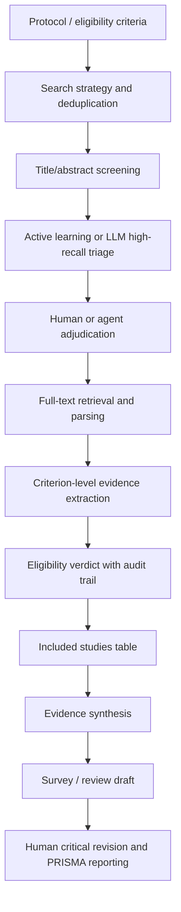

# Systematic Review Screening 自動化與 Survey 自動撰寫進展

日期：2026-04-25  
範圍：systematic review / scoping review 的 study screening 自動化、LLM/agent 化進展、工具生態、治理規範，以及這些技術是否已經延伸到 academic survey / literature review 自動撰寫。

## 0. 研究方法與可信度分層

本報告採用 orchestrator + subagent 分工方式完成，並同步做本地來源交叉查證。

- Subagent A：traditional ML / active learning / priority screening。
- Subagent B：2023-2026 LLM-based screening 實證。
- Subagent C：工具與平台，包含 Covidence、Rayyan、Elicit、DistillerSR、EPPI-Reviewer、ASReview、Nested Knowledge 等。
- Subagent D：PRISMA / Cochrane / RAISE 類治理與 reporting guidance。
- Subagent E：是否延伸到 automated survey / literature survey writing。
- OMX：使用隔離 OMX lab 做只讀能力檢查；`doctor` 通過，`agents list` 可用；`omx explore` 只有 Rust harness warning，因此本輪實際研究以 native subagent + web verification 為主，沒有讓 OMX 對專案做寫入操作。

證據分層：

- 高可信：peer-reviewed journal article、official documentation、PRISMA/Cochrane/RAISE 類 guidance。
- 中可信：正式會議論文、官方 vendor docs、AHRQ white paper、官方透明度記錄。
- 前沿但需保留：medRxiv/arXiv preprint、vendor-led evaluation、LLM-as-judge 評估。

## 1. 一句話結論

截至 2026-04-25，systematic review screening 自動化已經從「能不能幫忙」進入「如何安全部署」階段；但成熟的是 human-in-the-loop 的 priority screening、second reviewer、quality control 和 evidence extraction，不是可在高風險 review 中普遍取代人類的 fully autonomous screening。

同時，automated survey writing 進展很快，但主流仍是 retrieval + clustering/outline + RAG + LLM drafting。它吸收了「文獻選取」思想，卻大多沒有繼承 systematic review 的 PRISMA-style selection provenance、inclusion/exclusion audit trail、雙階段 title/abstract -> full-text screening，以及可復核的 stopping rule。因此，現在還不能說「screening 自動化已經成熟套用到嚴格 survey 自動撰寫」。更準確的說法是：兩條線正在靠近，但尚未合流成 PRISMA-first -> auditable evidence table -> auto-draft 的成熟標準流程。

## 2. 關鍵術語

| 術語 | 中文解釋 | 重要性 |
| --- | --- | --- |
| Systematic Review | 系統性綜述。用預先定義的 protocol、檢索策略、納入/排除標準，盡量完整識別、篩選、評估並綜合證據。 | 比一般 narrative review 更要求可重現、可審計。 |
| Screening / Study Selection | 文獻篩選。通常分 title/abstract screening 與 full-text screening。 | 是 SR 最耗時且最怕漏文的步驟之一。 |
| Title/Abstract Screening | 只看題名與摘要做初篩。 | 高召回優先，通常寧可多放進 full-text。 |
| Full-text Screening | 讀全文後確認是否符合 eligibility criteria。 | 更接近最終納入決策，也更依賴全文解析品質。 |
| Active Learning | 主動學習。模型依照人類已標註的 include/exclude 不斷更新，優先推送最可能相關的 records。 | 傳統 ML screening 自動化的核心。 |
| Priority Screening | 優先排序式篩選。模型不直接刪文，而是把可能相關的文獻排前面。 | 目前最被接受的安全部署形式。 |
| Researcher-In-The-Loop (RITL) | 研究者在回路中。模型排序，人類提供標註與最終判斷。 | ASReview 等工具的核心理念。 |
| Stopping Rule | 停止規則。決定何時可以停止篩剩下的 records。 | 這是最大風險點，因為錯誤停止會造成 false negatives。 |
| Recall / Sensitivity | 召回率/敏感度。真正該納入的 studies 中，被系統抓到的比例。 | SR screening 最重要指標，通常比 precision 更重要。 |
| Specificity | 特異度。真正不該納入的 studies 中，被正確排除的比例。 | 高 specificity 可省工，但可能犧牲 recall。 |
| Precision / PPV | 精確率/陽性預測值。模型判 include 的 records 中，真正該納入的比例。 | 低 precision 代表人還要看很多 false positives。 |
| WSS@95 | Work Saved over Sampling at 95% recall。達到 95% recall 時，相比隨機/全人工可省多少工作量。 | active learning 文獻常用效率指標。 |
| LLM | Large Language Model，大型語言模型。可根據 criteria 與文本做分類、理由生成、資料抽取。 | 2023 後 screening 研究快速增長的主因。 |
| RAG | Retrieval-Augmented Generation，檢索增強生成。先找出相關片段，再讓 LLM 判斷/生成。 | full-text screening 與 survey drafting 都常用。 |
| Audit Trail | 審計軌跡。記錄誰/什麼工具在何時用何規則做了什麼判斷。 | automation 要能被 PRISMA-style reporting 接受，必須保留。 |
| PRISMA 2020 | Preferred Reporting Items for Systematic Reviews and Meta-Analyses。SR 報告規範。 | 已要求披露 automation tools 如何用於 study selection。 |
| PRISMA-AI | 面向 AI/automation 的 PRISMA 擴展方向；EQUATOR 仍列在 reporting guidelines under development。 | 目前不能當成已定稿、可替代 PRISMA 2020 的正式標準。 |

## 3. 傳統 ML / Active Learning 的現況

### 3.1 成熟點

傳統路線的主流不是讓模型直接取代 reviewer，而是用 active learning 做 priority screening。典型流程是：

1. 人類先標一小批 records，作為 seed / prior knowledge。
2. 模型學到哪些特徵接近 include。
3. 系統把更可能 include 的 records 排到前面。
4. 人類持續標註，模型持續更新排序。
5. 若要提前停止，必須有明確 stopping rule 與 validation。

ASReview 是這條線最清楚的開源代表。官方文檔把它定義為 RITL：machine learning model 負責 ranking，human 提供 labels；並稱 ASReview LAB 可用 active learning 大幅減少 screening time。來源：[ASReview docs](https://asreview.readthedocs.io/en/latest/lab/about.html)、[Nature Machine Intelligence ASReview paper](https://www.nature.com/articles/s42256-020-00287-7)。

Hamel et al. 2021 的 guidance 把這一類工具稱為 active machine-learning，並提出七步落地框架：stakeholder/expert consultation、search strategy、team preparation、database preparation、initial training set、ongoing screening、truncating screening。來源：[BMC Medical Research Methodology](https://link.springer.com/article/10.1186/s12874-021-01451-2)。

### 3.2 仍未解決的點

最大的難題不是 ranking，而是 early stopping。

傳統 active learning 能把 relevant records 推到前面，但「剩下的可不可以不看」仍然高度依賴：

- review question 是否單一清楚；
- eligibility criteria 是否可從 title/abstract 觀察；
- relevant studies 是否形態一致；
- seed set / pilot labels 是否準確；
- stopping rule 是否經過同領域或本 review 的驗證；
- 是否保留雙人/抽樣復核。

所以傳統 ML 的穩健結論是：priority screening 已經成熟；universal safe stopping rule 尚未成熟。

## 4. LLM-based Screening 的進展

### 4.1 Title/Abstract Screening

2023-2026 的 LLM 研究顯示，title/abstract screening 已經具備相當可用性，但最合理定位仍是 high-sensitivity assistant。

BMC Systematic Reviews 的 exploratory study 指出，LLM-based title/abstract screening 有可行性，但 performance 依 model、prompt、dataset 而大幅變動；作者也強調 academic research 的門檻很高，理想上不能漏掉 relevant publications。來源：[Systematic Reviews 2024](https://link.springer.com/article/10.1186/s13643-024-02575-4)。

2025-2026 的 evidence synthesis 開始更量化：

- Lieberum et al. 2025 scoping review：LLM support 覆蓋 13 個 SR steps 中的 10 個，最常見是 literature search、study selection、data extraction；但結論是 on the rise, not yet ready for unsupervised use。來源：[PubMed record](https://pubmed.ncbi.nlm.nih.gov/40021099/)。
- 2026 Journal of Clinical Epidemiology systematic review：納入 63 studies、148 LLM performance assessments；title/abstract screening median positive percent agreement 約 0.92，negative percent agreement 約 0.89；full-text screening median PPA 約 0.93，NPA 約 0.92；risk of bias assessment 表現較弱。來源：[ScienceDirect abstract page](https://www.sciencedirect.com/science/article/pii/S089543562600096X)。
- Cao et al. 2025 Annals of Internal Medicine：10 個 SR、48,425 citations abstract screening、12,690 full-text articles；optimized prompts 達 weighted sensitivity 97.7% / specificity 85.2% abstract screening，以及 sensitivity 96.5% / specificity 91.2% full-text screening；zero-shot sensitivity 約 49%，顯示 prompt engineering 不是小修飾，而是主變因。來源：[Annals/Ovid abstract](https://www.ovid.com/journals/aime/abstract/10.7326/annals-24-02189~development-of-prompt-templates-for-large-language)。

### 4.2 Full-text Screening 與 RAG

Full-text screening 的 LLM 化正在變得可行，但比 title/abstract 更依賴全文解析、chunking、RAG、exclusion rationale，以及 missingness handling。

目前最有價值的做法不是把全文整篇丟給模型，而是：

- 先做 PDF -> clean text / markdown；
- 用 retrieval 找出 eligibility-relevant spans；
- 讓 LLM 對每條 criterion 輸出 support / refute / insufficient evidence；
- 再生成 final include/exclude/maybe；
- 保留 quote、page/section、source path、confidence 和 exclusion reason。

這與本 repo 近來的 BCPCS / evidence packet / claim packet 方向一致：把 final verdict 變成可檢查的 evidence-carrying decision，而不是只看一句 include/exclude。

### 4.3 Agentic / End-to-end SR Automation

otto-SR 類工作代表了 2025-2026 的前沿方向：用 agentic workflow 將 screening、full-text parsing、data extraction、meta-analysis 串起來。其 manuscript 聲稱在多個 review 上達到高 screening sensitivity/specificity，並可快速 reproduce/update Cochrane reviews。來源：[otto-SR manuscript PDF](https://ottosr.com/manuscript.pdf)。

但這類結果目前應列為前沿證據，不宜直接當成方法學共識，原因是：

- 部分仍是 preprint/manuscript；
- 往往依賴特定 model、parser、prompt 與資料可得性；
- LLM-as-judge 或 corrected gold standard 仍有方法學爭議；
- supplementary data、figures、author correspondence、non-standard outcome reporting 仍是常見 failure mode；
- 對 qualitative reviews、複雜多問題 reviews、跨領域 reviews 的泛化仍不足。

## 5. 工具與平台生態

| 工具 | 主要定位 | 自動化能力 | 是否適合正式 SR workflow | 是否自動寫 survey/review |
| --- | --- | --- | --- | --- |
| ASReview LAB | open-source active learning screening | title/abstract priority screening、simulation、validation | 適合 screening engine；需另配合 extraction/reporting 工具 | 否 |
| Covidence | mature SR workflow SaaS | dedup、screening、full-text stage、data extraction、RoB templates；AI 較保守 | 適合 | 否，偏 workflow |
| Rayyan | screening collaboration + AI | dedup、blind screening、AI Reviewer、AI Analyzer、auto extraction | 適合，但 AI 決策需 human review | 不以寫作為主 |
| DistillerSR | enterprise/regulatory evidence platform | AI rerank、AI classifiers、Smart Evidence Extraction、audit trail | 很適合合規/企業 | 可支援 reports/summary，但不是一鍵論文 |
| EPPI-Reviewer | evidence synthesis platform | priority screening、coding、data extraction、synthesis、LLM coding | 方法學強，學習曲線高 | 可產生 synthesis outputs，不是 consumer auto-writing |
| Nested Knowledge | living review / visualization / extraction | Smart Screener、tags、MA extraction、versioning、visuals | 適合 living review 與可視化 | 可產生 manuscript-like artifacts，仍需人工 |
| Elicit | AI research assistant / SR workflow | search、screening、optional full-text screening、extraction、research report | 可輔助，但不應替代 PRISMA-grade workflow control | 是，能產生 research report draft |
| Consensus | discovery + Deep Search | literature search、ranking、study snapshots、review-like output | 輔助探索，不是 SR manager | 是，偏 literature review draft |
| Semantic Scholar tools | discovery infrastructure | API、recommendation、TLDR、paper QA | 主要是 discovery，不是 team screening audit | 摘要/問答，不是 SR manuscript |
| RobotReviewer | RCT RoB/PICO extraction | risk of bias、PICO、supporting text | 特定 RCT tasks 有用 | 否 |
| Trialstreamer | RCT identification/data infrastructure | RCT detection、PICO extraction、sample size | 研究 infrastructure，不是通用 SR workflow | 否 |

工具選型結論：

- 若目標是正式 systematic review / HTA / guideline：優先看 DistillerSR、EPPI-Reviewer、Nested Knowledge、Covidence、Rayyan。
- 若目標是低成本、透明、可本地跑的 screening acceleration：ASReview LAB 是最穩的開源起點。
- 若目標是快速做 literature review draft：Elicit、Consensus、AutoSurvey 類工具更接近，但它們不是嚴格的 PRISMA screening workflow。

## 6. 治理與 Reporting：現在應該怎麼寫

### 6.1 PRISMA 2020 仍是主幹

PRISMA 2020 已經要求在 study selection 中說明 automation tools 的使用細節，例如多少 reviewer screening、是否 independent、automation tools 如何整合。來源：[PRISMA 2020 checklist](https://pmc.ncbi.nlm.nih.gov/articles/PMC8008539/)、[BMJ PRISMA 2020 explanation](https://www.bmj.com/content/372/bmj.n160)。

因此即使沒有正式 PRISMA-AI，現在也不能把 AI screening 藏在 methods 之外。最低限度應報告：

- tool name、version、model name、date；
- prompt / instruction / criteria；
- model temperature、threshold、stopping rule；
- training / calibration / validation data；
- 哪些 records 被 AI 排序、標記、排除、復核；
- human override 數量與原因；
- PRISMA flow 中 automation 排除或標記的 records；
- 最終決策是否仍由人類 reviewer 確認。

### 6.2 RAISE / Cochrane / joint position statement 的方向

2025 Cochrane、Campbell、JBI、Collaboration for Environmental Evidence 的 joint position statement 明確把 AI use 連到責任、透明、風險容忍度與 mitigation。文中也提到 rapid review 中 single-reviewer abstract screening 可能漏掉約 13% relevant studies，因此 AI 作為第二 reviewer 可能降低此風險，但前提是工具透明、可驗證。來源：[Environmental Evidence 2025 position statement](https://link.springer.com/article/10.1186/s13750-025-00374-5)。

核心治理原則：

- 不要把 AI 當成不需驗證的黑箱 reviewer。
- protocol 階段先寫明 AI use，而不是跑完後補寫。
- validation set 與 sensitivity target 要先定。
- 對 false negatives 要保守。
- model/prompt/version 要可重跑或至少可審計。
- full automation 的主張必須比 human-in-the-loop 承擔更高證據門檻。

## 7. Survey 自動撰寫：有沒有把 screening 套過去？

### 7.1 已經存在的 survey generation 系統

近兩年 automatic survey / literature review generation 很活躍：

- AutoSurvey：NeurIPS 2024，流程包含 initial retrieval、outline generation、section drafting by specialized LLMs、integration/refinement、evaluation/iteration。來源：[NeurIPS proceedings](https://proceedings.neurips.cc/paper_files/paper/2024/hash/d07a9fc7da2e2ec0574c38d5f504d105-Abstract-Conference.html)。
- SurveyX：把 survey composing 拆成 Preparation 與 Generation，強調 online literature acquisition、structured preprocessing、multimodal generation。來源：[OpenReview](https://openreview.net/forum?id=QzE5x8pJc4)。
- SciReviewGen：ACL Findings 2023 dataset，超過 10,000 literature reviews 與 690,000 cited papers，用於 automatic literature review generation benchmark。來源：[arXiv](https://arxiv.org/abs/2305.15186)。
- SurveyGen / QUAL-SG：EMNLP 2025，建立 4,200+ human-written surveys、242,143 cited references，加入 quality-aware indicators 做 RAG source selection；作者明確指出 fully automatic generation 仍有 citation quality 與 critical analysis 問題。來源：[ACL Anthology](https://aclanthology.org/2025.emnlp-main.136/)。
- SurveyForge：ACL 2025，強調 outline heuristics、memory-driven generation、multi-dimensional evaluation。來源：[GitHub / paper links](https://github.com/InternScience/SurveyForge)。
- AutoSurvey2：2025/2026 preprint/TKDD track，強調 retrieval、reasoning、automated evaluation、iterative refinement。來源：[arXiv](https://arxiv.org/abs/2510.26012)。
- Agentic AutoSurvey：multi-agent framework，包含 Paper Search Specialist、Topic Mining & Clustering、Academic Survey Writer、Quality Evaluator。來源：[arXiv](https://arxiv.org/abs/2509.18661)。
- NSR 2025 automated review-generation method：端到端做 literature search、topic formulation、knowledge extraction、review composition，並公開 prompts/intermediate data/code；但仍不是標準 PRISMA-style screening pipeline。來源：[National Science Review](https://academic.oup.com/nsr/advance-article/doi/10.1093/nsr/nwaf169/8120226)。

### 7.2 是否真正使用 systematic review screening？

目前答案是：部分吸收，但尚未真正合流。

這些 automated survey systems 多數做的是：

- semantic retrieval；
- citation graph / clustering；
- quality-aware retrieval；
- outline induction；
- RAG-based section generation；
- LLM-as-judge evaluation；
- iterative refine / polish。

它們通常沒有完整實作：

- database-specific Boolean search reproducibility；
- deduplication log；
- title/abstract screening log；
- full-text eligibility log；
- inclusion/exclusion reasons per record；
- dual-reviewer conflict resolution；
- PRISMA flow diagram；
- stopping rule；
- final included-studies table linked to evidence spans。

所以它們更像「高級 retrieval + synthesis + drafting」系統，而不是 systematic review screening automation 的直接下游。

最接近橋接的是 SurveyGen 的 quality-aware retrieval、NSR 2025 的 end-to-end review generation、Agentic AutoSurvey / LiRA 類 multi-agent writing workflow。但這些仍未提供成熟的 PRISMA-grade provenance。

## 8. 對本 repo 與後續實驗的直接啟示

本 repo 目前的 production truth 是 cutoff-first、stage-specific criteria、multi-reviewer workflow，以及 single-reviewer baseline 只作 experiment track。外部文獻支持以下方向：

1. 不要把 derived operational hardening 寫回 formal criteria。這和 repo 的 no criteria supertranslation 原則一致。
2. Stage 1 應該是 high-recall triage，而不是過早精準排除。
3. Stage 2 的提升重點不是 prompt 更長，而是 evidence interface 更穩：criterion claims、support/refute spans、missingness、source path、confidence、audit trail。
4. LLM screening 若要可信，必須保留 structured output、model/prompt/version、threshold、human/agent adjudication、failure taxonomy。
5. 如果要把 screening 接到 survey writing，應走 PRISMA-first pipeline，而不是直接 RAG 寫 survey。

建議的 research workflow：

如果要設計「screening -> survey writing」的新實驗，應明確分兩層：

- Selection layer：PRISMA-style search、dedup、screening、full-text eligibility、audit trail。
- Writing layer：taxonomy / outline induction、evidence table、citation-grounded synthesis、critical analysis、human revision。

不要讓 writing layer 反向污染 selection layer；也不要讓 LLM 為了寫得順而 silently drop 邊緣但重要的 studies。

## 9. 現階段最可辯護的落地策略

### 9.1 正式 SR / HTA / guideline

- 使用 Covidence / DistillerSR / EPPI-Reviewer / Nested Knowledge / Rayyan 這類 workflow platform 管理審計。
- AI 先作 priority screening、second reviewer 或 error checker。
- 預先定義 validation set、target recall、stopping rule。
- full-text screening 必須輸出 criterion-level rationale。
- 所有 model/prompt/threshold/版本進 methods。

### 9.2 開源或研究原型

- ASReview 做 title/abstract priority screening。
- 自建 LLM second reviewer，但只作輔助，不直接刪文。
- full-text 走 deterministic parsing + RAG + structured JSON verdict。
- 用已完成 SR 的 labelled corpus 做 retrospective validation。
- 報告 WSS@95、recall、specificity、FN inventory，而不是只報 accuracy。

### 9.3 自動 survey writing

- 不要從 query 直接生成 survey。
- 先建立 included-paper ledger。
- 再建立 evidence table / taxonomy / outline。
- 最後才生成 prose。
- 每段 synthesis 都應該能回連到 included studies 與 evidence spans。

## 10. 主要研究缺口

- 通用且安全的 stopping rule 仍不足。
- LLM screening 的 cross-domain robustness 還不夠清楚。
- PDF/full-text parsing 仍會造成 upstream evidence loss。
- Risk of bias assessment、complex data extraction 比 screening 更不穩。
- Vendor tools 的 claims 常比 independent validation 更樂觀。
- Automated survey generation 缺少 PRISMA-style provenance。
- Fully autonomous SR 的 benchmark 還太少，且 gold standard 本身常有 human error。

## 11. 核心參考來源

### Screening / Active Learning

- ASReview documentation: https://asreview.readthedocs.io/en/latest/lab/about.html
- ASReview Nature Machine Intelligence paper: https://www.nature.com/articles/s42256-020-00287-7
- Hamel et al. 2021 guidance: https://link.springer.com/article/10.1186/s12874-021-01451-2
- O'Connor et al. 2020 Abstrackr / EPPI comparison: https://systematicreviewsjournal.biomedcentral.com/articles/10.1186/s13643-020-01324-7
- Liang et al. 2022 meta-analysis: https://pmc.ncbi.nlm.nih.gov/articles/PMC9277646/
- Van Dijk et al. 2024 stopping criteria: https://link.springer.com/article/10.1186/s13643-024-02699-7

### LLM Screening

- BMC / Systematic Reviews 2024 LLM title/abstract exploratory study: https://link.springer.com/article/10.1186/s13643-024-02575-4
- Lieberum et al. 2025 scoping review: https://pubmed.ncbi.nlm.nih.gov/40021099/
- Cao et al. Annals 2025 prompt templates: https://www.ovid.com/journals/aime/abstract/10.7326/annals-24-02189~development-of-prompt-templates-for-large-language
- 2026 JCE systematic review of LLM SR tasks: https://www.sciencedirect.com/science/article/pii/S089543562600096X
- Prompt engineering prospective study: https://www.cambridge.org/core/journals/research-synthesis-methods/article/prompt-engineering-of-large-language-models-for-paper-screening-in-medical-metaanalyses-and-systematic-reviews-a-prospective-comparative-study/A8EB5B6A3E472CBA91BE8BA7D9DAB623
- otto-SR manuscript: https://ottosr.com/manuscript.pdf

### Tools / Platforms

- Covidence automation features: https://support.covidence.org/help/overview-of-all-automation-ai-features-available-in-covidence
- Rayyan ResearchPilot: https://help.rayyan.ai/hc/en-us/articles/28790380408337-Rayyan-ResearchPilot-Search-Screen-Extract-with-AI
- Elicit systematic reviews: https://support.elicit.com/en/articles/7927169
- Elicit evaluation: https://elicit.com/blog/how-we-evaluated-elicit-systematic-review/
- DistillerSR AI: https://www.distillersr.com/products/distillersrai
- DistillerSR review software: https://www.distillersr.com/products/distillersr-systematic-review-software
- RobotReviewer: https://www.robotreviewer.net/about
- Trialstreamer paper: https://pmc.ncbi.nlm.nih.gov/articles/PMC7727361/

### Governance / Reporting

- PRISMA 2020 statement/checklist: https://pmc.ncbi.nlm.nih.gov/articles/PMC8008539/
- PRISMA 2020 explanation and elaboration: https://www.bmj.com/content/372/bmj.n160
- EQUATOR reporting guidelines under development / PRISMA-AI: https://www.equator-network.org/library/reporting-guidelines-under-development/reporting-guidelines-under-development-for-systematic-reviews/
- Cochrane Handbook chapter 4 technical supplement: https://www.cochrane.org/authors/handbooks-and-manuals/handbook/chapter04-tech-supplonlinepdfv65270924
- 2025 joint AI position statement: https://link.springer.com/article/10.1186/s13750-025-00374-5
- Cochrane responsible AI news/resources: https://www.cochrane.org/about-us/news/how-did-cochrane-select-ai-tools-evaluate-our-platform-study

### Automated Survey / Literature Review Writing

- AutoSurvey NeurIPS 2024: https://proceedings.neurips.cc/paper_files/paper/2024/hash/d07a9fc7da2e2ec0574c38d5f504d105-Abstract-Conference.html
- SurveyX: https://openreview.net/forum?id=QzE5x8pJc4
- SciReviewGen: https://arxiv.org/abs/2305.15186
- SurveyGen / QUAL-SG: https://aclanthology.org/2025.emnlp-main.136/
- SurveyForge: https://github.com/InternScience/SurveyForge
- AutoSurvey2: https://arxiv.org/abs/2510.26012
- Agentic AutoSurvey: https://arxiv.org/abs/2509.18661
- NSR automated review-generation method: https://academic.oup.com/nsr/advance-article/doi/10.1093/nsr/nwaf169/8120226
