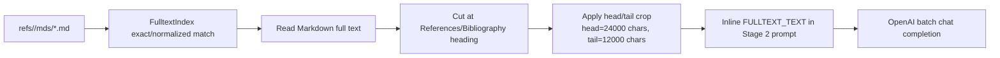
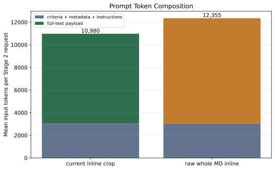
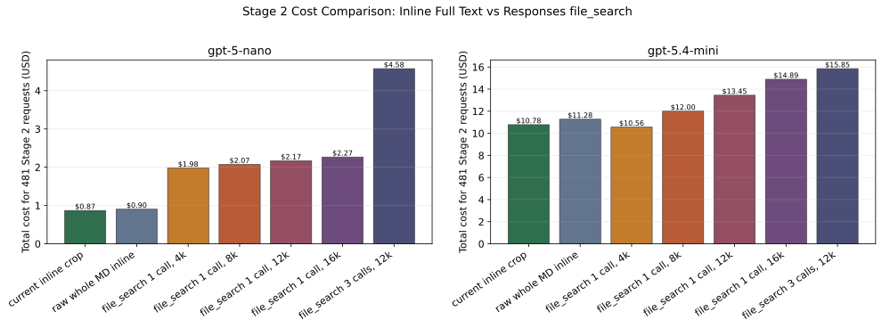
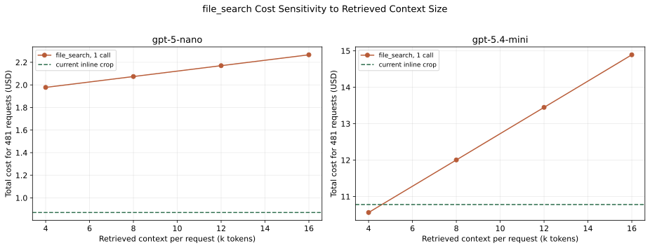
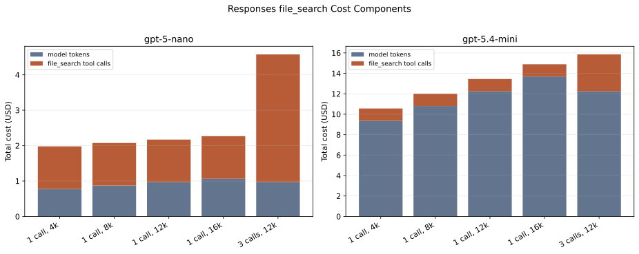
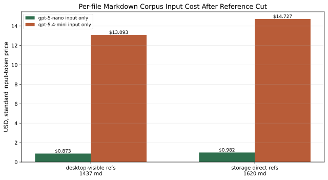
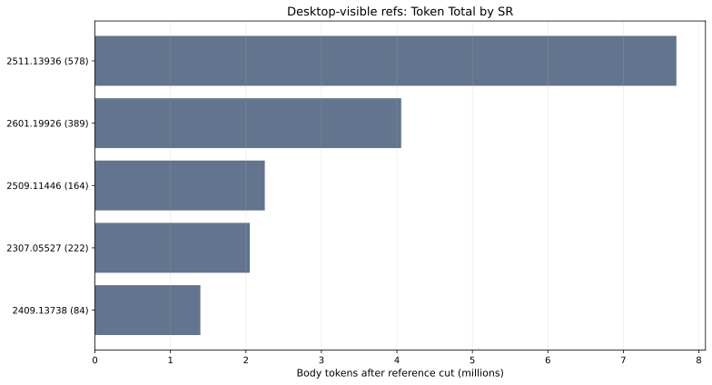
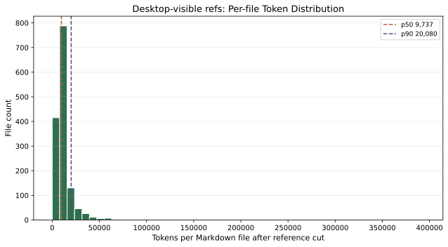
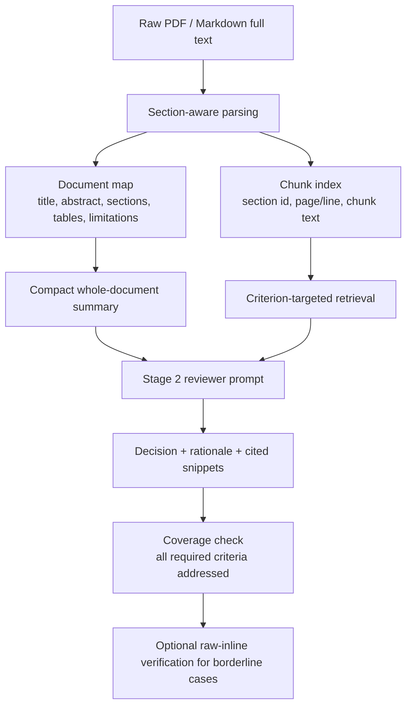

# OpenAI Full Text Screening: Inline Markdown vs File Search Cost and Quality Report

生成日期：2026-05-01  
範圍：`NLP_PRISMA_Reviews` 的 Stage 2 full-text screening  
主要問題：OpenAI API 下，Stage 2 應把 Markdown full text inline 餵給 LLM，還是改用 `file_search` 會更便宜、表現更好？

## 1. Executive Summary

最短結論：

1. `gpt-5-nano`：維持 inline full text/crop 較便宜。`file_search` 的 tool-call fee 比 nano input token 成本更重。
2. `gpt-5.4-mini`：標準 API 價格下，`file_search` 只有在每篇抓回約 4k tokens 以下才可能稍微便宜。若沿用目前 Batch workflow，inline crop 仍通常較便宜。
3. 表現面：不能把 OpenAI `file_search` 當成 Stage 2 的 drop-in replacement。對 eligibility screening，retrieval miss 是主要風險。
4. 較合理的長期方向是 hybrid：保留全文 Markdown，建立 section-aware chunk/document map，按 Stage 2 criteria 做 targeted retrieval，再把 evidence snippets + 必要 raw chunks 交給模型判斷。
5. 逐篇 `refs/*/mds/*.md` corpus 計算已補上：desktop-visible current refs 是 `1437` 篇，reference cut 後合計 `17,457,470` input tokens；直接數外接碟 `refs` 是 `1620` 篇，reference cut 後合計 `19,636,551` input tokens。

本報告現在有兩層計算：

1. Stage 2 request 成本：用現有 batch artifacts 的 prompt/output usage 重算，主估算採用 `481` 個 Stage 2 request。
2. Corpus-wide Markdown input cost：逐篇讀取 `refs/*/mds/*.md`，套用 reference-heading cut，不做 head/tail crop，一篇一篇 tokenize 後再加總。

Stage 2 request 估算採用：

- `2409.13738` / `2511.13936`：`20260408_full_gpt54mini_xhigh_2stagedirect_2409_2511`，Stage 2 `50` requests。
- `2307.05527` / `2601.19926`：`20260417_retry1_gpt54mini_xhigh_2stagedirect_2307_2601`，Stage 2 `431` requests。

注意：這是成本與 ingestion strategy 報告，不是 current score authority 報告。`2307` / `2601` 的 current score authority 仍是 `CURRENT.md` 指向的 stable senior_no_marker metrics。

## 2. Current Repo Behavior

目前 Stage 2 不是 raw 整篇 Markdown 直接塞進模型。實際流程是：



本地實作錨點：

- `apply_head_tail_limit(...)`：`scripts/screening/experiment_workflows/merged_batch_engine.py`
- `_cut_before_references(...)`：同檔案
- `FulltextIndex.resolve(...)`：同檔案
- `fulltext_payload_from_resolution(...)`：同檔案

舊的 LatteReview wrapper 有 `inline|file_search|hybrid` 參數，但目前 `file_search` / `hybrid` 仍是 `NotImplementedError`。因此本 repo 的現況是 inline only。

## 3. OpenAI Pricing and File Search Facts

官方文件核對日期：2026-05-01。

模型標準價格：

| Model | Input / 1M tokens | Cached input / 1M tokens | Output / 1M tokens | Context |
|---|---:|---:|---:|---:|
| `gpt-5-nano` | `$0.05` | `$0.005` | `$0.40` | `400k` |
| `gpt-5.4-mini` | `$0.75` | `$0.075` | `$4.50` | `400k` |

OpenAI `file_search` 官方口徑：

| Item | Value |
|---|---:|
| Responses API `file_search` tool call | `$2.50 / 1k calls` |
| Vector storage | `$0.10 / GB / day` |
| Free storage | first `1 GB` |
| Default chunk size | `800 tokens` |
| Default overlap | `400 tokens` |
| Default embedding model | `text-embedding-3-large`, `256 dimensions` |
| Default max chunks in context | up to `20`, may be fewer |
| Retrieval | query rewrite, parallel searches, keyword + semantic, rerank |

重要 caveat：

- Pricing page 明確說 `file_search` tool-call pricing applies to the Responses API only。
- Tokens used by built-in tools are still billed at the selected model input/output rates。
- OpenAI docs also state better summarization support is still a known limitation, and current file search is optimized for search queries。

官方來源：

- https://developers.openai.com/api/docs/pricing
- https://developers.openai.com/api/docs/models/gpt-5-nano
- https://developers.openai.com/api/docs/models/gpt-5.4-mini
- https://developers.openai.com/api/docs/assistants/tools/file-search

## 4. Data and Method

### 4.1 Source Artifacts

成本估算使用已完成的 Stage 2 input/output batch artifacts：

| Paper group | Run | Requests |
|---|---|---:|
| `2409.13738`, `2511.13936` | `screening/results/single_reviewer_official_batch_2stage_direct_review_2409_2511_2026-04-06/runs/20260408_full_gpt54mini_xhigh_2stagedirect_2409_2511/` | `50` |
| `2307.05527`, `2601.19926` | `screening/results/single_reviewer_official_batch_2stage_direct_review_2307_2601_2026-04-17/runs/20260417_retry1_gpt54mini_xhigh_2stagedirect_2307_2601/` | `431` |
| Total |  | `481` |

另有一個 earlier full run 對 `2307` / `2601` 是 `411` Stage 2 requests；本報告使用 `retry1` 的 `431`，因為它是 corrected current-style run family 中較後的 artifact。若改用 earlier run，總量會變成 `461`，但成本排序不變。

檔案類型說明：本報告 6.1 的實際 token 基礎是 repo 當前 Stage 2 已產生的 prompt/output usage，而這些 prompt 的全文來源是 `refs/<SR>/mds/*.md`。因此：

- `Current inline crop` = Markdown full text 經 reference cut + head/tail crop 後 inline。
- `Raw whole Markdown inline` = 同一批 resolved `mds/*.md` raw Markdown 估算。
- `file_search` rows = retrieved-token scenario，不是實際把 `.md` 或 `.pdf` 上傳到 OpenAI vector store 後量測。

也就是說，6.1 是「基於 Markdown pipeline 的 inline 成本 + file_search 情境估算」，不是「Markdown file_search vs PDF file_search 實測」。

### 4.4 Corpus-wide `refs` Markdown Calculation

為了回答「現在 `refs/` 中 1400 多篇 Markdown 逐篇讀取會多少錢」，本報告另做 corpus-wide per-file 計算。這一節不用 Stage 2 request usage，而是直接讀檔。

兩個範圍分開列：

| Scope | Counting command / meaning | File count |
|---|---|---:|
| `desktop_visible_refs_find_L` | `find -L /Users/xjp/Desktop/NLP_PRISMA_Reviews/refs -path '*/mds/*.md' -type f ! -name '._*'`，也就是目前 desktop repo 透過 symlink 看得到的 current `refs` Markdown | `1437` |
| `storage_direct_refs` | `find /Volumes/My Book/NLP_PRISMA_Reviews/refs -path '*/mds/*.md' -type f ! -name '._*'`，也就是外接碟 backing store 直接包含的 Markdown | `1620` |

計算規則：

1. 每個 `.md` 檔案獨立讀取、獨立 tokenize，再加總；不建立一個巨型 prompt。
2. Tokenizer 使用 `tiktoken.get_encoding("o200k_base")`。
3. Encoding 使用 `disallowed_special=()`。
4. Reference cut 模仿現有 Stage 2 code：逐行檢查 `line.strip().lower().rstrip(":")` 是否等於 `references` 或 `bibliography`，命中後只保留該行之前的內容。
5. 不做 `24000/12000` head/tail crop，因為這裡要看 reference cut 後的每篇 Markdown full body 成本。
6. 成本只算 input token cost；未知的審查 prompt overhead、output tokens、reasoning tokens 另計。

### 4.2 Token Counting

Tokenization：

- 使用 `tiktoken` 的 `o200k_base`。
- 對 paper text 使用 `disallowed_special=()`，避免 paper 內 literal special-token 字串造成 tokenizer failure。

Token 欄位：

- `prompt_tokens_actual`：OpenAI batch output usage 中的實際 `prompt_tokens`。
- `completion_tokens_actual`：OpenAI batch output usage 中的實際 `completion_tokens`，包含 reasoning tokens。
- `visible_fulltext_tokens`：Stage 2 prompt 中實際 inline 的 cropped full-text block。
- `raw_fulltext_tokens`：同一 resolved Markdown file 的 raw full-text token count。
- `base_prompt_tokens_est`：`prompt_tokens_actual - visible_fulltext_tokens`，代表 criteria、metadata、instructions、schema 等非全文部分。

### 4.3 Cost Formula

Inline full text：

```text
cost = input_tokens * input_price + output_tokens * output_price
```

Responses `file_search`：

```text
cost =
  (base_prompt_tokens + retrieved_tokens) * input_price
  + output_tokens * output_price
  + tool_calls * 2.50 / 1000
  + max(vector_store_gb - 1, 0) * storage_days * 0.10
```

本報告的 `file_search` scenario 先假設 vector store storage still within free 1 GB 或短期成本可忽略，因此 storage cost = `0`。若長期保留且超過 1 GB，每天再加 `$0.10 / GB` 的超額 storage。

## 5. Token Results

### 5.1 Overall Token Distribution

| Metric | Total | Mean | P50 | P90 | Max |
|---|---:|---:|---:|---:|---:|
| Actual Stage 2 prompt tokens | `5,281,604` | `10,980.5` | `11,381` | `12,823` | `16,383` |
| Actual completion tokens | `1,515,259` | `3,150.2` | `2,715` | `6,345` | `14,395` |
| Visible cropped full text tokens | `3,818,650` | `7,939.0` | `8,378` | `9,681` | `12,858` |
| Raw Markdown full text tokens | `4,479,843` | `9,313.6` | `8,576` | `13,746` | `61,043` |
| Non-fulltext base prompt tokens | `1,462,954` | `3,041.5` | `2,940` | `3,605` | `4,032` |

### 5.2 Paper-Level Mean Tokens

| Paper | Stage 2 N | Prompt mean | Visible full text mean | Raw full text mean |
|---|---:|---:|---:|---:|
| `2307.05527` | `148` | `11,568.2` | `8,012.1` | `8,612.4` |
| `2409.13738` | `23` | `9,939.7` | `6,896.3` | `8,378.7` |
| `2511.13936` | `27` | `10,671.3` | `7,741.0` | `8,400.1` |
| `2601.19926` | `283` | `10,787.2` | `8,004.4` | `9,843.5` |

### 5.3 Prompt Token Composition



Interpretation：

- Current inline crop 的平均 prompt 約 `10,981` tokens。
- 若改成 raw whole Markdown inline，平均 prompt 約 `12,355` tokens。
- 在這批 Stage 2 request 上，raw whole Markdown 比 current crop 貴，但不是數倍級差距。

## 6. Cost Results

### 6.1 Standard API Cost

以下是 `481` 個 Stage 2 request 的總成本估算。`file_search` scenarios 假設每個 request 最終生成一次 answer，並在該 answer 的上下文中放入固定 retrieved tokens。

Important scope note：本表的 inline rows 使用 `mds/*.md`。`file_search` rows 不區分 `.md` / `.pdf`，因為它們是用固定 retrieved-token 數量計算 API 成本，而不是實際上傳兩種檔案後比較 OpenAI 解析、chunking、embedding 與 retrieval 結果。若真的用 `.pdf` 建 vector store，成本與品質可能不同：PDF parser 可能抽出不同文字、表格/頁眉頁腳/欄位順序，chunk 數與 vector storage 大小也可能不同。

| Strategy | `gpt-5-nano` total | `gpt-5-nano` / request | `gpt-5.4-mini` total | `gpt-5.4-mini` / request |
|---|---:|---:|---:|---:|
| Current inline crop | `$0.8702` | `$0.001809` | `$10.7799` | `$0.022411` |
| Raw whole Markdown inline | `$0.9032` | `$0.001878` | `$11.2758` | `$0.023442` |
| `file_search`, 1 call, 4k retrieved | `$1.9780` | `$0.004112` | `$10.5614` | `$0.021957` |
| `file_search`, 1 call, 8k retrieved | `$2.0742` | `$0.004312` | `$12.0044` | `$0.024957` |
| `file_search`, 1 call, 12k retrieved | `$2.1704` | `$0.004512` | `$13.4474` | `$0.027957` |
| `file_search`, 1 call, 16k retrieved | `$2.2666` | `$0.004712` | `$14.8904` | `$0.030957` |
| `file_search`, 3 calls, 12k retrieved total | `$4.5754` | `$0.009512` | `$15.8524` | `$0.032957` |



### 6.2 Retrieval Size Sensitivity



Break-even intuition：

| Model | One-call `file_search` break-even retrieved-token budget |
|---|---:|
| `gpt-5-nano` | impossible for all `481/481` requests under these assumptions |
| `gpt-5.4-mini` | mean `4,606` tokens, P50 `5,045` tokens; `8/481` requests still impossible |

Meaning：

- For `gpt-5-nano`, even if `file_search` retrieves very little text, the `$0.0025` per call fee usually exceeds the input-token savings.
- For `gpt-5.4-mini`, one retrieval call can beat inline only if retrieved context stays around `4k-5k` tokens. At OpenAI default max up to 20 chunks, the context can approach `16k` tokens, where `file_search` is clearly more expensive in this workload.

### 6.3 File Search Cost Components



The key asymmetry is visible here:

- `gpt-5-nano` token cost is so low that the fixed tool-call fee dominates.
- `gpt-5.4-mini` token cost is high enough that retrieval can help, but only if retrieval is narrow and well-controlled.

### 6.4 Batch API Caveat

The current repo workflow uses OpenAI Batch API. Official pricing pages list Batch pricing separately and OpenAI public pricing pages describe Batch as discounted for input/output tokens. Tool-call fees are not token prices, so do not assume the `file_search` call fee is halved.

For `gpt-5.4-mini`, if token prices are halved but the Responses `file_search` tool-call fee remains unchanged:

| Strategy | Approx Batch-adjusted total |
|---|---:|
| Current inline crop | `$5.39` |
| Raw whole Markdown inline | `$5.64` |
| `file_search`, 1 call, 4k retrieved | `$5.88` |
| `file_search`, 1 call, 8k retrieved | `$6.60` |
| `file_search`, 1 call, 12k retrieved | `$7.32` |
| `file_search`, 1 call, 16k retrieved | `$8.05` |
| `file_search`, 3 calls, 12k retrieved total | `$9.73` |

Therefore, under the current Batch-shaped workflow, `file_search` is less attractive on cost than the standard-price table suggests.

### 6.5 Corpus-wide `refs` Markdown Input Cost

這一節是新的逐篇 `mds/*.md` 計算，不同於 6.1 的 Stage 2 request 成本。它回答的是：如果把目前 `refs` 裡的 Markdown 一篇一篇作為 LLM input 讀取，reference cut 後的 input-token 成本是多少。

#### 6.5.1 Scope-Level Summary

| Scope | Files | Raw tokens | Tokens after reference cut | Files cut | Tokens removed | Mean | P50 | P90 | Max |
|---|---:|---:|---:|---:|---:|---:|---:|---:|---:|
| Desktop-visible current `refs` | `1437` | `19,229,428` | `17,457,470` | `179` | `1,771,958` | `12,148.6` | `9,737` | `20,079.8` | `394,564` |
| Storage direct `refs` | `1620` | `21,453,304` | `19,636,551` | `180` | `1,816,753` | `12,121.3` | `9,633` | `20,008.7` | `394,564` |



#### 6.5.2 Input-Only Cost

| Scope | `gpt-5-nano` input cost | `gpt-5.4-mini` input cost | One `file_search` call per file, tool fee only |
|---|---:|---:|---:|
| Desktop-visible current `refs`, `1437` files | `$0.8729` | `$13.0931` | `$3.5925` |
| Storage direct `refs`, `1620` files | `$0.9818` | `$14.7274` | `$4.0500` |

Interpretation：

- 這裡是 input-only cost，不含任何 reviewer instructions、criteria JSON、metadata、output tokens 或 reasoning tokens。
- 對 `gpt-5-nano`，讀完整個 desktop-visible Markdown corpus 的 input token 成本不到 `$1`；若用 Responses `file_search` 且每篇至少一次 tool call，光 tool-call fee 就是 `$3.5925`。
- 對 `gpt-5.4-mini`，desktop-visible Markdown corpus 的 input-only 成本約 `$13.09`，storage direct corpus 約 `$14.73`。
- 因為這裡是逐篇加總，沒有假設一次把 corpus 全部塞進同一個上下文。Input token cost 本身是線性的，所以逐篇總和與 token total 乘單價一致；但 per-request overhead、output tokens、tool-call fee 不會自動等價，必須另算。

#### 6.5.3 Desktop-Visible SR Breakdown

| SR | Files | Tokens after reference cut | Mean | P50 | P90 | Max | `gpt-5-nano` input | `gpt-5.4-mini` input |
|---|---:|---:|---:|---:|---:|---:|---:|---:|
| `2307.05527` | `222` | `2,051,105` | `9,239.2` | `7,727.5` | `16,561.8` | `49,980` | `$0.1026` | `$1.5383` |
| `2409.13738` | `84` | `1,396,418` | `16,624.0` | `9,282.5` | `17,175.3` | `394,564` | `$0.0698` | `$1.0473` |
| `2509.11446` | `164` | `2,249,962` | `13,719.3` | `10,325.0` | `29,107.1` | `57,667` | `$0.1125` | `$1.6875` |
| `2511.13936` | `578` | `7,703,025` | `13,327.0` | `10,442.0` | `23,324.9` | `110,412` | `$0.3852` | `$5.7773` |
| `2601.19926` | `389` | `4,056,960` | `10,429.2` | `9,193.0` | `14,306.8` | `65,618` | `$0.2028` | `$3.0427` |





Largest observed file in both scopes：

- `refs/2409.13738/mds/omg_uml.md`
- after reference cut：`394,564` tokens

That one file alone is near the context window of `gpt-5-nano` / `gpt-5.4-mini` if any sizable prompt or output budget is added, so a robust runner should still keep a per-file max-token guard.

## 7. Quality and Performance Analysis

Cost is only one side. Screening accuracy depends on whether the model sees the necessary eligibility evidence.

### 7.1 Strategy Matrix

| Strategy | Cost profile | Coverage | Main risk | Best use |
|---|---|---|---|---|
| Current inline crop | Cheap and simple | Head + tail after reference cut | Middle-section evidence can be missed | Current baseline, smoke/full batch screening |
| Raw whole Markdown inline | Slightly more expensive here | Best single-call coverage | More noise, long-context attention dilution | Audit runs, borderline papers, small corpora |
| Plain OpenAI `file_search` | Can be cheaper for `gpt-5.4-mini` only if retrieval is small | Depends on query and ranking | Retrieval miss on critical eligibility evidence | Narrow factual lookup, repeated targeted queries |
| Hybrid retrieval + verification | Engineering cost higher, API cost controllable | Better if section-aware and criterion-aware | Implementation and evaluation complexity | Long-term production hardening |

### 7.2 Why Plain File Search Is Risky for Stage 2

Stage 2 eligibility is not just a factual question like "what is the dataset size?" It often requires checking several necessary conditions:

- paper type and language/full-text availability,
- whether the method is concrete,
- whether the target is inside the SR scope,
- whether there is empirical validation,
- whether exclusion criteria fire.

If `file_search` misses one criterion-relevant passage, the model may confidently make the wrong inclusion/exclusion decision. OpenAI's default `file_search` is useful, but it is optimized for search queries and has known limitations around summarization. Full-text screening is closer to a structured audit than a casual Q&A over files.

### 7.3 Recommended Architecture

Recommended future direction:



This is not simply "use file_search". It is a repo-specific retrieval workflow:

1. Generate stable section IDs and chunks from `mds/*.md`.
2. Build per-paper document map and compact summary.
3. Retrieve per Stage 2 criterion, not with one generic query.
4. Keep retrieved chunk IDs in the result artifact.
5. Verify all inclusion/exclusion criteria have either evidence or explicit uncertainty.
6. For borderline or high-risk cases, fall back to raw inline or larger context.

## 8. Recommendation

### 8.1 Operational Recommendation

For immediate use:

1. Keep current inline crop for `gpt-5-nano`.
2. Keep current inline crop for `gpt-5.4-mini` if using Batch.
3. Do not replace Stage 2 with plain OpenAI `file_search` without a controlled eval.
4. If cost is the only concern, raw whole Markdown inline is not dramatically more expensive than current crop on the inspected 481 requests, but it may add noise.

For method improvement:

1. Implement a hybrid prototype on a small eval slice.
2. Compare three methods on identical Stage 2 candidates:
   - current inline crop,
   - raw whole Markdown inline,
   - section-aware retrieval + verification.
3. Evaluate not only F1 but also failure type:
   - retrieval miss,
   - criterion interpretation error,
   - evidence insufficiency,
   - metadata/fulltext resolution error.

### 8.2 Decision Rule

Use this practical rule:

| Condition | Preferred method |
|---|---|
| Cheap high-volume model like `gpt-5-nano` | Inline crop |
| Batch API with `gpt-5.4-mini` | Inline crop |
| Standard API with `gpt-5.4-mini`, retrieval can be kept under 4k tokens | Test `file_search` or custom retrieval |
| Borderline paper where missing one section matters | Raw whole Markdown inline or hybrid verification |
| Long-term robust screening pipeline | Section-aware hybrid retrieval |

## 9. Reusable Function Added

Reusable cost helpers were added in:

- `scripts/screening/fulltext_cost_estimator.py`

Tests were added in:

- `tests/screening/test_fulltext_cost_estimator.py`

Covered functions:

- `token_cost_usd(...)`
- `inline_fulltext_cost_usd(...)`
- `responses_file_search_cost_usd(...)`
- `responses_file_search_response_cost_usd(...)`
- `compare_inline_to_responses_file_search(...)`

Validation command:

```sh
PYTHONDONTWRITEBYTECODE=1 python3 -m unittest tests.screening.test_fulltext_cost_estimator
```

Result:

```text
Ran 5 tests in 0.000s
OK
```

`pytest` was not available in this environment, so unittest was used.

## 10. Generated Chart and Data Artifacts

Chart assets:

| Artifact | Purpose |
|---|---|
| `docs/paper_fulltext/assets/openai_fulltext_cost_20260501/cost_by_strategy_standard.svg` | Standard API cost comparison |
| `docs/paper_fulltext/assets/openai_fulltext_cost_20260501/file_search_retrieval_sensitivity.svg` | Cost sensitivity to retrieved tokens |
| `docs/paper_fulltext/assets/openai_fulltext_cost_20260501/token_composition_stage2.svg` | Prompt token composition |
| `docs/paper_fulltext/assets/openai_fulltext_cost_20260501/file_search_cost_components.svg` | Token vs tool-call cost breakdown |
| `docs/paper_fulltext/assets/openai_fulltext_cost_20260501/refs_md_corpus_input_cost.svg` | Corpus-wide Markdown input-only cost |
| `docs/paper_fulltext/assets/openai_fulltext_cost_20260501/refs_md_tokens_by_sr_desktop_visible.svg` | Desktop-visible `refs` token total by SR |
| `docs/paper_fulltext/assets/openai_fulltext_cost_20260501/refs_md_token_distribution_desktop_visible.svg` | Desktop-visible per-file token distribution |

Machine-readable summaries:

| Artifact | Purpose |
|---|---|
| `docs/paper_fulltext/assets/openai_fulltext_cost_20260501/stage2_cost_estimate_summary.csv` | Cost table by model and strategy |
| `docs/paper_fulltext/assets/openai_fulltext_cost_20260501/stage2_token_summary.csv` | Token summary |
| `docs/paper_fulltext/assets/openai_fulltext_cost_20260501/refs_md_per_file_token_cost_20260501.csv` | Per-file Markdown token and input-cost table |
| `docs/paper_fulltext/assets/openai_fulltext_cost_20260501/refs_md_sr_token_cost_summary_20260501.csv` | Per-SR and total Markdown token/cost summary |
| `docs/paper_fulltext/assets/openai_fulltext_cost_20260501/refs_md_corpus_token_cost_summary_20260501.json` | Compact corpus-level summary |

## 11. Limitations

1. This report estimates `file_search` cost from retrieved-token scenarios. It does not run an actual OpenAI `file_search` experiment.
2. Retrieval quality is not measured here. Accuracy claims about `file_search` require an eval slice.
3. Storage cost is set to zero in the main scenarios because the first 1 GB is free and the current question is per-run strategy. Long-lived vector stores above 1 GB add daily cost.
4. The raw whole Markdown estimate uses resolved `mds/*.md`; PDF images, figures, and some tables may still be poorly represented in Markdown.
5. PDF-based `file_search` was not benchmarked here. PDF and Markdown can have different parsed text, chunk counts, storage footprint, retrieval recall, and therefore effective cost/quality.
6. Corpus-wide `refs` Markdown cost in Section 6.5 is input-only. A real screening run must add reviewer instructions, criteria, metadata, output tokens, and possibly reasoning tokens.
7. Model pricing is date-sensitive. Recheck official pricing before launching expensive runs.

## 12. Bottom Line

For this repo and these inspected Stage 2 artifacts, `file_search` is not a clear cost win:

- `gpt-5-nano`：inline crop is clearly cheaper.
- `gpt-5.4-mini` standard API：`file_search` can barely win only at very small retrieval sizes.
- `gpt-5.4-mini` Batch：inline crop is still favored.

The performance argument also does not favor plain `file_search`. The right engineering target is not "replace full text with file_search", but "build a criterion-aware hybrid retrieval/verification layer while keeping raw full text available for audit and fallback."

For corpus-wide Markdown reading, the revised concrete baseline is:

- desktop-visible current `refs`: `1437` Markdown files, `17.46M` post-reference-cut input tokens, `$0.8729` on `gpt-5-nano` input-only, `$13.0931` on `gpt-5.4-mini` input-only.
- storage direct `refs`: `1620` Markdown files, `19.64M` post-reference-cut input tokens, `$0.9818` on `gpt-5-nano` input-only, `$14.7274` on `gpt-5.4-mini` input-only.
