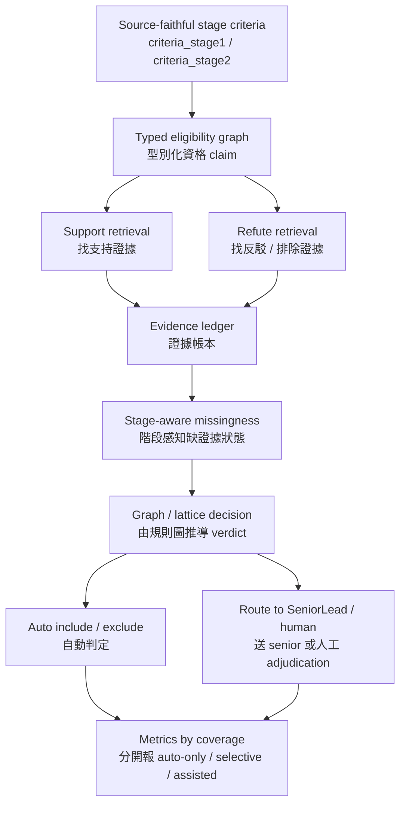
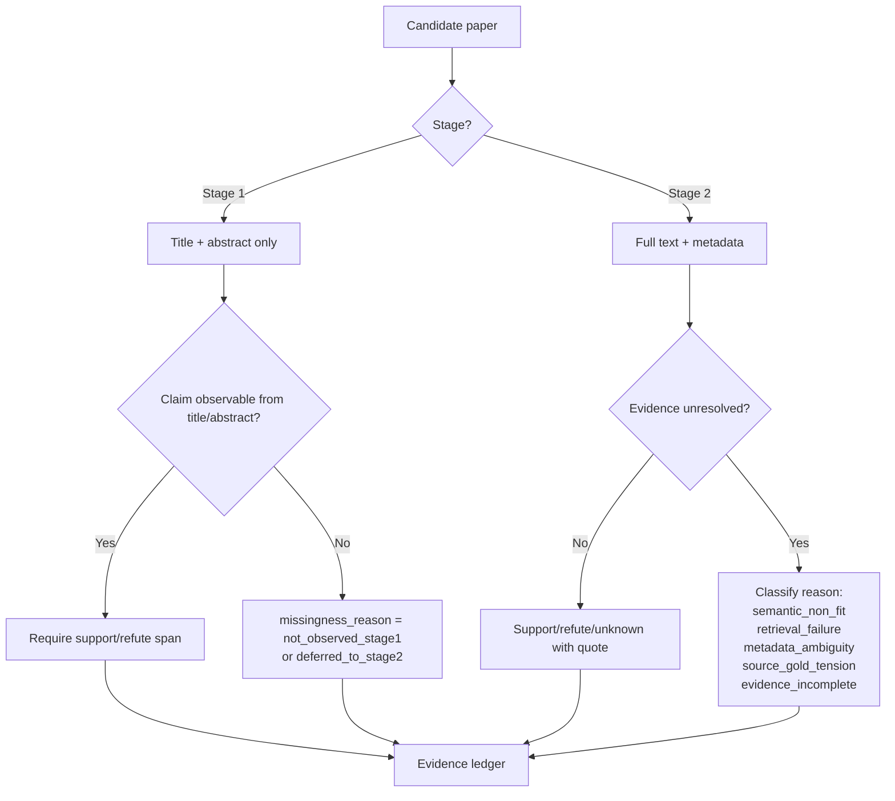
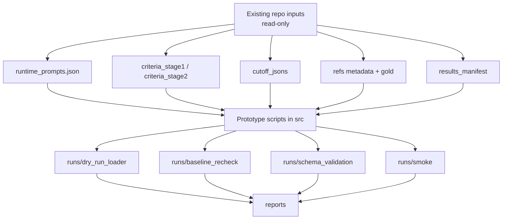
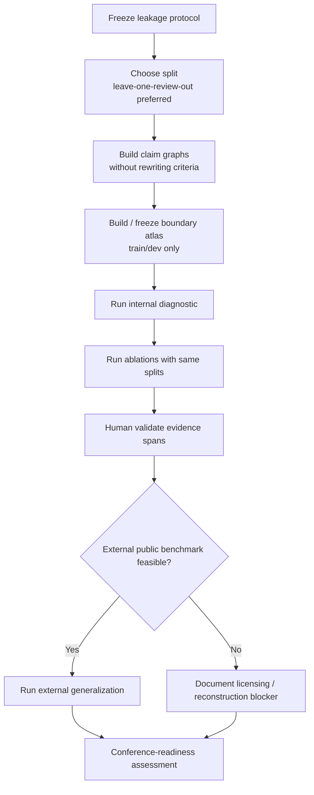
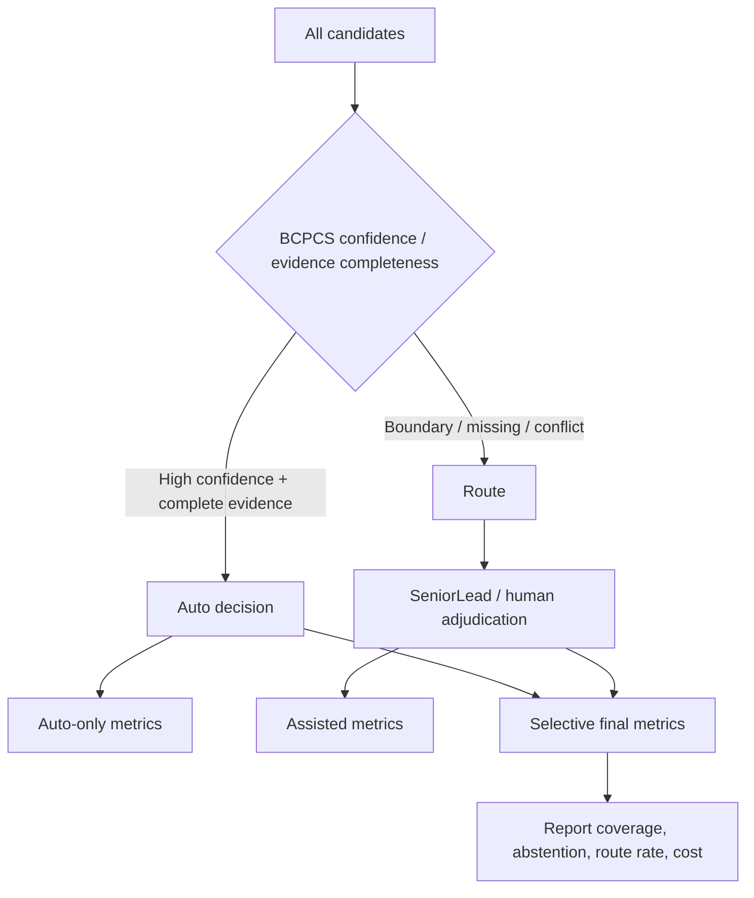

# BCPCS 流程圖

這份文件用中文流程圖說明 BCPCS 的資料流、實驗流和 artifact flow。這些圖是方法導讀，不是新的 protocol。

## 1. 方法總覽

重點：

- LLM 不直接自由輸出 final verdict。
- LLM 或 verifier 只能幫忙填 evidence ledger。
- Final verdict 要由 graph/lattice 推導。
- 不確定 case 必須 route，不可假裝自動解決。

## 2. Stage 1 / Stage 2 的缺證據處理

重點：

- Stage 1 的 `not observed` 不能自動當成 `NO`。
- Stage 2 的 unknown 也不能只寫 unknown，必須區分原因。

## 3. Artifact flow

重點：

- 左邊都是 read-only existing repo inputs。
- 所有新輸出都在 `research_bcpcs_2026-04-18/`。
- 不寫 production paths。

## 4. Benchmark 路線

重點：

- `leakage_control.md` 必須先 freeze。
- Boundary atlas 不能從 held-out FP/FN 建。
- Internal diagnostic 不能當唯一 conference evidence。

## 5. Selective routing 的報告方式

必須分開報：

- Auto-only F1
- Selective final F1
- Senior/human-assisted F1
- Coverage
- Abstention rate
- Routed-case count
- Cost

不能把 assisted final F1 偽裝成 fully automated F1。
