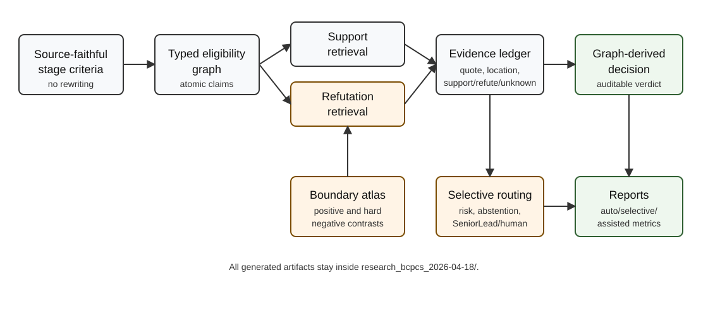

# Literature Review: Toward Proof-Carrying Systematic-Review Screening

## Scope

This literature map supports an NLP/IR methods paper on systematic-review
screening. It is not a formal PRISMA systematic review. It focuses on methods
published or active in 2020-2026 across LLM screening, QA decomposition,
technology-assisted review, evidence grounding, calibration, adjudication, and
evaluation leakage.

## Conceptual Figure

## Field Map

| Cluster | Representative Work | Evidence-Backed Takeaway | Gap For BCPCS |
| --- | --- | --- | --- |
| LLM title/abstract screening | Guo et al. 2024; Dennstadt et al. 2024; Matsui et al. 2024 | LLMs can screen titles and abstracts competitively, but sensitivity, specificity, and generalization vary by review. | Direct include/exclude prompting is unstable for near-miss boundaries. |
| Criteria-to-QA screening | Akinseloyin et al. 2024 | Decomposing eligibility criteria into questions improves abstract screening over simple relevance prompts. | QA answers still require reliable synthesis, refutation, and stage-aware missingness. |
| LLM-guided ranking | LGAR 2025 | Criteria-aware ranking can improve SLR retrieval/screening workflows at scale. | Ranking alone does not produce proof-carrying final eligibility decisions. |
| Active learning and TAR | ASReview; Continuous Active Learning; stopping criteria work | Active learning reduces workload and supports high-recall screening. | TAR often optimizes prioritization, not auditable criterion-level decisions. |
| Evidence grounding and claim verification | FEVER; SourceCheckup; extraction benchmarks | Verdicts should be tied to retrieved evidence, but quoted spans can still be irrelevant or overinterpreted. | SR screening needs support/refute ledgers and span-level validation. |
| RAG and full-text screening | Trad et al. 2025; TrialMind 2025 | Prompt engineering and RAG can reduce screening workload while preserving low false-negative rates in specific reviews. | RAG must be refutation-aware and not hide unresolved cases. |
| Calibration and selective prediction | Issaiy et al. 2024; Cochrane high-recall classifier; OLIVER-style calibration | Thresholds and selective workflows are required when recall risk matters. | Methods must report auto-only, selective, and human-assisted performance separately. |
| Multi-agent adjudication | LLM ensembles, debate, dual-reviewer extraction | Voting and debate can improve robustness but may reproduce shared model bias. | Agents need typed roles and cannot directly free-form vote on verdict. |
| Benchmark validity | SESR-Eval; active-learning reviews; LLM benchmark reproducibility work | Retrospective evaluation is sensitive to leakage, label noise, API drift, and review-specific difficulty. | A publishable method requires leakage-controlled splits and external generalization. |

## Evidence-Backed Findings

1. LLM screening can be strong but is not reliably perfect. Biomedical title and
   abstract screening studies report high sensitivity for some models and
   datasets, but specificity and stability vary substantially.

2. Eligibility criteria are not enough when read as free text. QA-based systems
   show that criteria decomposition helps, but they also expose error
   propagation from question generation, question answering, and answer
   synthesis.

3. Active learning and TAR provide the dominant high-recall workload-reduction
   framing. Their strongest contribution is screening prioritization and recall
   control, not proof-carrying final decisions.

4. Evidence grounding is necessary but insufficient. A quote must be evaluated
   for actual support or refutation; unsupported citations and irrelevant spans
   are known failure modes in medical and scientific LLM systems.

5. Selective automation is more defensible than fully automatic perfect
   screening. Systems should expose bounded risk, abstention, routed cases, and
   manual burden.

## Inferred Tensions

- Direct LLM screening is easy to benchmark but hard to trust.
- QA decomposition improves structure but can still leave the final decision
  under-specified.
- RAG can retrieve relevant text but usually favors supporting evidence unless
  refutation is explicitly searched.
- Human-assisted final F1 can be high, but reporting it as automated F1 is
  misleading.
- Internal four-review evaluation is useful for diagnosis but insufficient for
  NLP/IR claims without external benchmarks or a public annotation contribution.

## BCPCS Research Gap

BCPCS should contribute a systematic-review-specific interface:

1. Criteria become typed claims, not prompt prose.
2. Each claim gets support, refutation, or explicit missingness.
3. Stage 1 missing evidence is represented differently from Stage 2 unresolved
   evidence.
4. Hard boundary cases are calibrated through leakage-controlled contrastive
   archetypes.
5. Final decisions are graph-derived and selectively routed under risk control.

The gap is not "LLM plus criteria plus RAG." The gap is a proof-carrying
decision calculus for SR screening.

## Key Sources

- Akinseloyin O, Jiang X, Palade V. A question-answering framework for automated abstract screening using large language models. JAMIA. https://doi.org/10.1093/jamia/ocae166
- PRISMA 2020 statement. https://pmc.ncbi.nlm.nih.gov/articles/PMC8005925/
- ASReview active learning framework. https://www.nature.com/articles/s42256-020-00287-7
- LGAR criterion-aware ranking. https://arxiv.org/abs/2505.24757
- FEVER evidence-based claim verification. https://arxiv.org/abs/1803.05355
- Streamlining systematic reviews with prompt engineering and RAG. https://link.springer.com/article/10.1186/s12874-025-02583-5
- Statistical stopping criteria for automated screening. https://link.springer.com/article/10.1186/s13643-020-01521-4
- Biomedical LLM title/abstract screening exploratory study. https://link.springer.com/article/10.1186/s13643-024-02575-4
- TrialMind / clinical evidence synthesis with LLMs. https://www.nature.com/articles/s41746-025-01840-7
- SESR-Eval title-abstract screening benchmark. https://arxiv.org/abs/2507.19027

