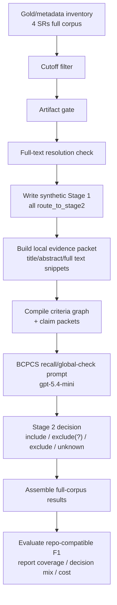

# BCPCS 簡報：目前流程與 `gpt-5.4-mini` 表現

日期：`2026-04-23`

## 範圍

- 目前有效 BCPCS run：
  - `research_bcpcs_2026-04-18/runs/bcpcs_full_corpus_split_batch_gpt54mini_globalcheck_claimpackets_all4_2026-04-23_v1_fallback_aggregate/`
- 比較 baseline 1：
  - single reviewer `1-stage`，`gpt-5.4-mini xhigh`
  - run: `20260423_gpt54mini_xhigh_singlestage_2307_2601` + `20260423_gpt54mini_xhigh_singlestage_2409_2511`
- 比較 baseline 2：
  - single reviewer `2-stage`
  - 每篇 paper 取已完成 `gpt-5.4-mini` run 中 combined F1 最佳者

重要：

- 這裡比較的是 `gpt-5.4-mini` 在三條 workflow 上的表現，不是 repo production authority replacement。
- 目前 BCPCS `xhigh` all4 run 因大量 `finish_reason=length` 導致比較無效，所以主表只用目前有效的 `low` 結果。
- 這份報告為了比較好讀，會把 BCPCS 原始 artifact 裡的 `maybe` 用 `exclude(?)` 來呈現。
- 但這只是展示名稱調整，不是重算分數；本文引用的 F1 仍然是原本 repo-compatible `include_or_maybe` 指標。

## 一頁摘要

- 目前有效 BCPCS all4 run 的整體 repo-compatible F1 是 `0.8864`。
- 若跟 `gpt-5.4-mini` single reviewer `1-stage` 比，BCPCS 輸在整體 F1：`0.8864 < 0.9168`。
- 若跟 `gpt-5.4-mini` single reviewer `2-stage` 比，BCPCS 贏在整體 F1：`0.8864 > 0.8715`。
- BCPCS 的主要優勢是 recall 很高：`0.9785`，遠高於 `1-stage` 的 `0.8692` 和 `2-stage` 的 `0.7903`。
- BCPCS 的主要弱點是 precision 明顯下降：`0.8101`，遠低於 `1-stage` 的 `0.9700` 和 `2-stage` 的 `0.9714`。
- 以 paper 來看，BCPCS 目前對 `2307`、`2601` 有優勢，但在 `2409`、`2511` 仍被 precision collapse 拖垮。

## BCPCS 在做什麼

如果用白話講，BCPCS 想做的事情不是「直接叫模型看完 paper 後隨便給一個 include / exclude verdict」，而是把 screening 這件事拆成幾個比較可檢查的步驟：

1. 先把 review paper 的 criteria 保留成 source-faithful 的條件。
2. 再把每個條件拆成比較明確的 eligibility claims，也就是「這篇 paper 需要滿足哪些可檢查的判斷點」。
3. 接著不是直接問模型最終要不要收，而是先讓模型去整理 evidence：
   - 哪些文字支持這個 claim
   - 哪些文字反駁這個 claim
   - 哪些地方其實證據不夠，或只能先標成 `unknown` / `exclude(?)`
4. 最後再根據這些 evidence packet、claim packets 和 stage-aware 規則去產生決策。

所以 BCPCS 的核心不是「prompt 變長一點」，而是把 screening verdict 變成一個比較像 proof-carrying 的決策流程：

- 先整理 criteria
- 再整理 claim
- 再整理 support / refute evidence
- 最後才下 include / exclude(?) / exclude

這樣做的目的，是希望模型不要只靠模糊印象判斷，而是必須拿出「為什麼這篇該收、為什麼不該收」的證據結構。

在這個 repo 目前有效的實作裡，BCPCS 實際上更像是：

- 先做 cutoff、artifact gate、fulltext resolution
- 再把可處理的 candidate 全部送進一個 proof-carrying 風格的 full-text adjudication
- 讓模型根據 local evidence packet 和 claim packets 做 Stage 2 judgment

也就是說，它現在不是一個標準的「Stage 1 先強力篩掉大部分、Stage 2 再少量複查」系統；目前更像是「把可進入 full text 的樣本，交給一個 evidence-driven 的 Stage 2 決策器」。

## 目前 BCPCS 實際流程圖

這張圖畫的是目前有效的 `global-check / claim-packets` full-corpus run，不是理想化概念圖。

對應到目前程式的幾個關鍵點：

- 先做 `cutoff`、`artifact gate`、`fulltext resolution`。
- 目前會先寫一個 synthetic `stage1_review`，內容是 deterministic `route_to_stage2`，不是正常 Stage 1 篩選。
- 真正主要判斷發生在帶 `evidence_packet + criteria_graph + claim_packets` 的 Stage 2。
- 原始 BCPCS 輸出如果是 `maybe`，本文會把它讀成 `exclude(?)`，表示偏向不收，但還帶有未完全坐實的邊界感。
- 因此，這條 BCPCS 線目前比較像「full-text adjudication with proof-carrying packet」，不是標準 single reviewer `2-stage` gate。

## 整體比較

| 系統 | 模型 / effort | Overall F1 | Precision | Recall | TP/FP/TN/FN | 備註 |
| --- | --- | ---: | ---: | ---: | --- | --- |
| BCPCS current | `gpt-5.4-mini low` | `0.8864` | `0.8101` | `0.9785` | `546 / 128 / 68 / 12` | 目前有效 all4 `global-check / claim-packets` |
| Single reviewer 1-stage | `gpt-5.4-mini xhigh` | `0.9168` | `0.9700` | `0.8692` | `485 / 15 / 181 / 73` | 同模型，但 effort 較高 |
| Single reviewer 2-stage | `gpt-5.4-mini` per-paper best | `0.8715` | `0.9714` | `0.7903` | `441 / 13 / 183 / 117` | `2307/2511/2601=xhigh`, `2409=low` |

解讀：

- 跟 `1-stage` 比：BCPCS 多救回很多正例，但新增了非常多 FP，所以整體還是輸。
- 跟 `2-stage` 比：BCPCS 明顯補回 FN，因此整體 F1 反而高一些。
- 目前 BCPCS 的本質仍是 recall-biased `exclude(?)` policy；原始系統標籤其實是 `maybe`，但就閱讀感受來說更像「傾向不收、但保留問號」。

## 各 paper 比較

| Paper | BCPCS headline | BCPCS `exclude(?)` 視角 | 1-stage baseline | 2-stage baseline | 簡短解讀 |
| --- | ---: | ---: | ---: | ---: | --- |
| `2307.05527` | `0.9072` | `0.2538` | `0.8959` | `0.8673` | headline 很強，但若把 `maybe` 讀成 `exclude(?)`，hard include 幾乎收不回來 |
| `2409.13738` | `0.5122` | `0.6061` | `0.9130` | `0.8095` | 這篇你指出得對，`exclude(?)` 視角下應是 `0.6061`，不是 `0.5122` |
| `2511.13936` | `0.6105` | `0.5366` | `0.8814` | `0.9123` | 這篇也要修正；`exclude(?)` 視角下應是 `0.5366` |
| `2601.19926` | `0.9587` | `0.8316` | `0.9308` | `0.8742` | headline 仍很強，但 `exclude(?)` 視角下就回到略低於兩個 baseline |

補充：

- `BCPCS headline` 是前面一直在用的 repo-compatible F1，也就是 repo 預設 `include_or_maybe` 規則。
- `BCPCS exclude(?) 視角` 則是把 `maybe` 一律當成 `exclude(?)`，只把 `include` 當正類後重算的分數。
- 所以你剛剛指出的問題是對的：`2409` 和 `2511` 在這個視角下不應該還寫成 `0.5122` / `0.6105`，而是 `0.6061` / `0.5366`。
- 用這個視角看，BCPCS 的真實樣子會更像「很多邊界 case 被推到 `exclude(?)`」，而不是穩定產生乾淨的 `include` / `exclude` 二分。

## 結論

- 如果問題是「目前 BCPCS 值不值得當成 current best `gpt-5.4-mini` screening line？」答案是：還不行。
- 它已經比 `gpt-5.4-mini` 的 `2-stage` baseline 更強 recall，也在 overall F1 上略勝，但還打不過 `1-stage` baseline。
- 真正卡住 BCPCS 的不是 coverage，也不是 runtime cleanliness；目前 all4 valid run coverage 已到 `99.47%`。卡點是 `2409`、`2511` 上的 precision collapse。
- 所以目前更準確的定位應該是：
  - `BCPCS = 高 recall、可運行、可量測，但尚未 precision-calibrated`
  - `single reviewer 1-stage = 目前這三條線裡整體 F1 最強`
  - `single reviewer 2-stage = 最保守，precision 高，但 recall 損失最大`

## Caveat

- `gpt-5.4-mini xhigh` 的 BCPCS all4 run 目前不應拿來做品質比較，因為大量 request 在 reasoning 階段耗盡 token，產生空輸出；那是 execution failure，不是乾淨的 quality signal。
